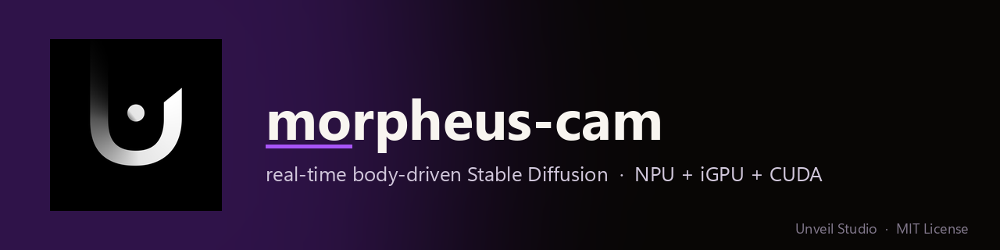
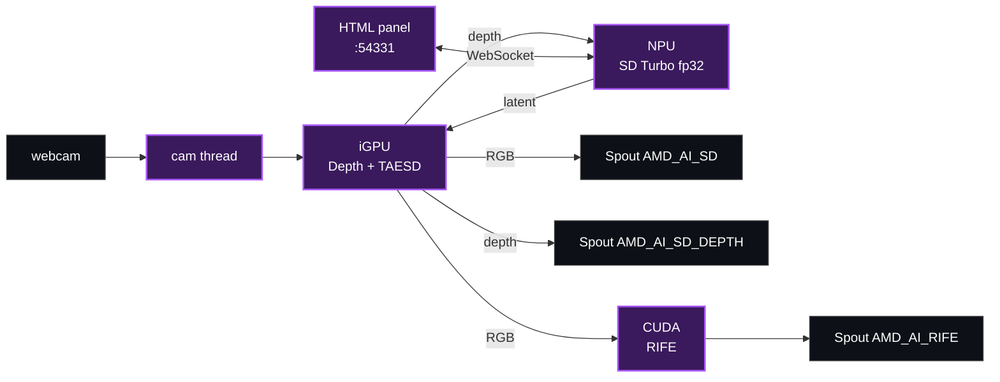
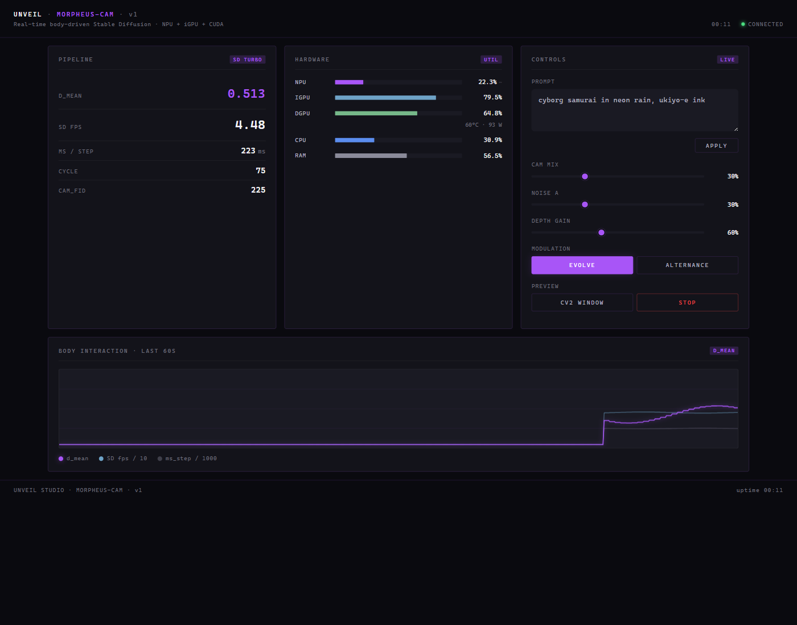

<p align="center">
  
</p>

<p align="center">
  
  
  
  
  
  
  <a href="AGENTS.md"></a>
</p>

# morpheus-cam

Body-driven **Stable Diffusion** in real time. Webcam → Depth Anything v2 (iGPU) modulates SD Turbo noise → SD UNet runs on the **XDNA2 NPU** → TAESD decodes on the iGPU → **RIFE** flow-interpolates on CUDA. Three **Spout** outputs at ~30 fps for TouchDesigner / OBS / Resolume.

Sister of [`NDIForPython`](https://github.com/UnveilStudio/NDIForPython), [`SPOUT2ForPython`](https://github.com/UnveilStudio/SPOUT2ForPython), [`wgsl-shm`](https://github.com/UnveilStudio/wgsl-shm).

## Pipeline

| Silicon | Stage | Cost |
|---|---|---|
| **NPU** XDNA2 (~50 TOPS) | SD Turbo UNet (fp32, `vaiml_compile_v4`) | ~250 ms / step |
| **iGPU** Radeon 880M | Depth Anything v2 small (FP16) + TAESD decoder | ~30 ms + ~10 ms |
| **dGPU** RTX 5070 | RIFE flow interp (CUDA, n_passes=3) | ~50 ms / pair → 9 frames |
| Result | 3 Spout outputs · NPU keyframes ~3-4 fps · display ~30 fps | |

Why fp32 on the NPU and not INT8? See [`bench/strobe/`](bench/strobe/) — the INT8 path on Ryzen AI 1.7.1 produces a deterministic NaN flip-flop, fp32 + `vaiml_compile_v4` doesn't. We pay 3-5× latency for zero corrupted frames; RIFE smooths it back to 30 fps.

TAESD ([@madebyollin](https://github.com/madebyollin/taesd)) is the trick: the full SD VAE decoder would be ~300 ms on the iGPU and would bottleneck the whole pipeline. TAESD at ~10 ms moves the bottleneck to the NPU, which is exactly where we want it.



## Three Spout outputs

| Sender | Carries | Rate |
|---|---|---|
| `AMD_AI_SD` | SD Turbo frame after TAESD (RGB 512²) | NPU rate, ~3-4 fps |
| `AMD_AI_SD_DEPTH` | Depth Anything visualisation (TURBO LUT) | webcam rate, ~30 fps |
| `AMD_AI_RIFE` | RIFE-interpolated display (RGB 512²) | display rate, ~30 fps |

Wire each as a separate `Spout In TOP` in TD Non-Commercial, or `Spout2 Capture` in OBS / Resolume / Notch / Unreal / Unity. Bindings: [`UnveilStudio/SPOUT2ForPython`](https://github.com/UnveilStudio/SPOUT2ForPython) (BSD-2, bundled `SpoutLibrary.dll`).

```bash
pip install git+https://github.com/UnveilStudio/SPOUT2ForPython.git
```

## Web control panel

Open <http://127.0.0.1:54331/> after starting the pipeline.

<p align="center">
  
</p>

| Control | Effect |
|---|---|
| **Prompt** | Re-encodes the SD prompt and resets temporal-noise memory |
| **Cam mix** | Latent-space blend SD ↔ webcam fake-latent (0–100%) |
| **Noise α** | Temporal-noise smoothing alpha (0 = frozen, 100 = independent) |
| **Depth gain** | How strongly depth modulates the SD initial noise |
| **Evolve / Alternance** | Toggle temporal smoothing / pulse raw-SD frames |
| **cv2 window** | Local OpenCV preview |
| **Stop** | Clean shutdown of NPU thread + iGPU process + RIFE subprocess |

Live read-outs: `d_mean` (depth pulse — moves with you), SD fps, ms/step, cycle, cam_fid. Hardware bars: CPU / RAM / NPU / iGPU / dGPU + dGPU temp & power. NPU% is derived from `ms_step` and marked with `~`. The bottom canvas plots the last 60 s.

## Quickstart

### 1. AMD Ryzen AI Software 1.7.1

Download from <https://www.amd.com/en/developer/resources/ryzen-ai-software.html>. Default install paths used by the entry point:

```
C:\Program Files\RyzenAI\1.7.1\GenAI-SD\
C:\Program Files\RyzenAI\1.7.1\voe-4.0-win_amd64\vaip_config.json
C:\Program Files\RyzenAI\1.7.1\deployment\onnx_custom_ops.dll
```

Edit the constants at the top of `morpheus_cam.py` if yours differ. The `GenAI-SD/` directory is **not** redistributable — that's why we don't ship it.

### 2. Two conda envs

```bash
# main process — NPU + iGPU
conda env create -f "C:\Program Files\RyzenAI\1.7.1\env.yaml" -n npu
conda activate npu
pip install -r requirements.txt
pip install git+https://github.com/UnveilStudio/SPOUT2ForPython.git

# RIFE worker — CUDA
conda create -n cuda python=3.10
conda activate cuda
pip install torch --index-url https://download.pytorch.org/whl/cu128
pip install numpy
```

### 3. Models

```bash
conda activate npu
python download_models.py
```

Fetches **TAESD** + **Depth Anything v2 small (FP16 ONNX)**. RIFE weights need a one-step manual download from Practical-RIFE's Google Drive — the script prints the link. The compiled SD Turbo NPU bundle is **not** auto-downloaded: follow the AMD `GenAI-SD/` quicktest to compile it for your local Ryzen AI install, then drop it under `models/sd/sd_turbo/`.

### 4. Run

```bash
$env:VAIP_CONFIG_JSON = "C:\Program Files\RyzenAI\1.7.1\voe-4.0-win_amd64\vaip_config.json"
conda activate npu
python morpheus_cam.py        # or: --webcam 1 --http-port 54331
```

Without `VAIP_CONFIG_JSON` VitisAI silently falls back to CPU and you get garbage / 1 fps.

## The NPU strobe

While shipping on **Ryzen AI 1.7.1** we hit a deterministic NaN flip-flop on the **INT8 UNet path**: bit-identical input, every other call returns NaN. Same network through **fp32 + `vaiml_compile_v4`** on the same NPU silicon: zero NaNs over 20 calls. Symptom isolated to `dyn_bins.dll`; we didn't chase it deeper.

It's deterministic, not flaky; not a timing race (sleep sweep 1 s → 0 ms preserves the alternation). Reproductions in [`bench/strobe/`](bench/strobe/). When the INT8 path stops NaN-ing, the swap is one line and we get a 3-5× speedup for free.

## Hardware

Built on a **[Razer Blade 14 (2025)](https://www.razer.com/gaming-laptops/razer-blade-14)**:

| Component | Role |
|---|---|
| AMD Ryzen AI 9 365 (Zen 5 + XDNA2 50 TOPS) | CPU + NPU running SD Turbo UNet |
| AMD Radeon 880M iGPU | Depth Anything + TAESD (DirectML) |
| NVIDIA RTX 5070 Laptop (115 W TGP) | RIFE (CUDA) |
| 32 GB LPDDR5X-8000 | Unified RAM — iGPU SHM hand-off is `memcpy` |

Same code runs on any Ryzen AI 300 laptop, but on a non-unified-memory machine you lose the iGPU SHM advantage.

## Why iGPU and not dGPU for TAESD/Depth

The iGPU has direct system-RAM access — TAESD/Depth on iGPU avoid a PCIe round-trip per frame. The dGPU is reserved for RIFE (CUDA-only) so it never contends. The NPU never touches PCIe — it writes the SD latent into shared system RAM that the iGPU reads directly.

## Repo layout

```
morpheus-cam/
├── morpheus_cam.py        # entry point — orchestrator, NPU thread, display loop
├── spout_sender.py        # Spout sender wrapper
├── download_models.py     # TAESD + Depth Anything + RIFE weights
├── control/{server,panel.html}   # HTTP + WS panel + hardware sampler
├── rife/{flow_worker,model,IFNet_HDv3}.py   # CUDA RIFE subprocess
├── bench/strobe/          # NPU INT8 NaN flip-flop reproductions
├── docs/                  # ARCHITECTURE.md + img/
├── AGENTS.md
└── requirements.txt
```

## Built on top of

This repository **does not redistribute** any third-party model weights, SDK binaries, or proprietary files. `download_models.py` fetches public weights from their original hosts; the SD Turbo NPU bundle and the AMD Ryzen AI SDK are obtained by the user from AMD / Hugging Face under their own terms. Each component below is independently licensed by its authors:

- **[TAESD](https://github.com/madebyollin/taesd)** by [@madebyollin](https://github.com/madebyollin) — MIT. Drop-in for the SD VAE decoder, ~30× faster.
- **[Depth Anything V2 (small)](https://github.com/DepthAnything/Depth-Anything-V2)** — code Apache 2.0; the small variant's weights are released under Apache 2.0 (the base/large variants are CC-BY-NC-4.0 and are **not** used here).
- **[Practical-RIFE](https://github.com/hzwer/Practical-RIFE)** by [@hzwer](https://github.com/hzwer) — code MIT; the pretrained `IFNet_HDv3` weights are released for **non-commercial** use only by the authors. Commercial users must contact the original authors.
- **[Stable Diffusion Turbo](https://huggingface.co/stabilityai/sd-turbo)** by Stability AI — [Stability AI Community License Agreement](https://stability.ai/community-license-agreement). Free for non-commercial use, and free for commercial use by entities or individuals with **less than $1M USD in annual revenue**; an Enterprise License is required above that threshold. Read and accept the licence directly with Stability AI before using the weights — it's your responsibility, not this repo's.
- **[Ryzen AI Software 1.7.1](https://www.amd.com/en/developer/resources/ryzen-ai-software.html)** by AMD — VitisAI EP, GenAI-SD, `vaiml_compile_v4`. Distributed by AMD under the AMD Software EULA; **not** redistributed here.
- **[Spout](https://github.com/leadedge/Spout2)** by [@leadedge](https://github.com/leadedge) — BSD-2-Clause. Wrapped via [`UnveilStudio/SPOUT2ForPython`](https://github.com/UnveilStudio/SPOUT2ForPython) which bundles `SpoutLibrary.dll` under BSD-2.

> ⚠️ **You are responsible** for complying with the licence of every model and SDK you download through `morpheus-cam`. We provide orchestration code only.

## Support

If the **MIT-licensed code in this repository** saves you time, you can support its maintenance:

- 🟧 **Patreon** — [patreon.com/unveil_studio](https://www.patreon.com/unveil_studio)
- 💸 **PayPal** — [paypal.me/Unveilstudio](https://paypal.me/Unveilstudio)

These contributions support development of the orchestration code only. They are **not** payment for, or a sublicense of, any third-party model, SDK, or weights — those remain governed by their respective authors' licences (see *Built on top of* above).

## License & disclaimers

The code in this repository is released under the **MIT License** — see [`LICENSE`](LICENSE). The MIT licence applies **only** to the source files authored by Unveil Studio in this repo. Third-party components are governed by their own licences as listed in the *Built on top of* section.

**No redistribution of third-party assets.** This repo does not contain, mirror, or redistribute any model weights, SDK binaries, proprietary headers, or vendor-supplied files. Where weights are needed, the user downloads them directly from the original publisher and accepts that publisher's licence terms.

**Trademarks.** AMD, Ryzen, Radeon, XDNA, and Ryzen AI are trademarks of Advanced Micro Devices, Inc. NVIDIA, CUDA, and GeForce RTX are trademarks of NVIDIA Corporation. Razer and Razer Blade are trademarks of Razer Inc. Stable Diffusion and SD Turbo are trademarks or product names of Stability AI Ltd. Spout is © Lynn Jarvis. TouchDesigner is a trademark of Derivative Inc. All other trademarks are the property of their respective owners. Names are used here in their nominative sense only, to identify the hardware and software this project interoperates with.

**No endorsement / no affiliation.** Unveil Studio is **not** affiliated with, endorsed by, sponsored by, or otherwise connected to AMD, NVIDIA, Razer, Stability AI, Hugging Face, Derivative, or any other party named in this repository. References are descriptive only.

**No warranty.** This software is provided "as is", without warranty of any kind, express or implied, as set out in the MIT licence. Generative models can produce unexpected, biased, or otherwise unwanted output; you are responsible for what you generate and how you use it.

NDI is not used in this project — for NDI output see [`NDIForPython`](https://github.com/UnveilStudio/NDIForPython).

## The Unveil Studio family

| Project | Accent | What it does |
|---|---|---|
| [NDIForPython](https://github.com/UnveilStudio/NDIForPython) | 🟦 cyan | NDI sender/receiver via `libndi`, ctypes-thin |
| [SPOUT2ForPython](https://github.com/UnveilStudio/SPOUT2ForPython) | 🟪 purple | Spout DX11 GPU sharing, BSD-2 SpoutLibrary.dll bundled |
| [wgsl-shm](https://github.com/UnveilStudio/wgsl-shm) | 🟧 coral | Real-time WGSL compute shaders on AMD iGPU → SHM / Spout / NDI |
| **morpheus-cam** *(this repo)* | 🟪 violet | Real-time body-driven Stable Diffusion · NPU + iGPU + CUDA |
