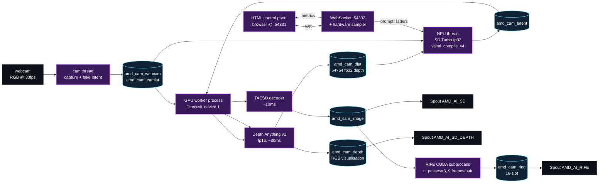

<p align="center">
  
</p>

<p align="center">
  
  
  
  
  
  
  
  <a href="AGENTS.md"></a>
</p>

# morpheus-cam

> **Live performance, no compromise.**

Body-driven **Stable Diffusion** in real time · **NPU + iGPU + CUDA** orchestration on a single hybrid laptop.

A webcam captures you. **Depth Anything v2** runs on the AMD iGPU and turns your silhouette into a depth map. That depth modulates the noise that **SD Turbo** runs through on the AMD XDNA2 NPU. **TAESD** decodes the latents back on the iGPU. **RIFE** flow-interpolates the keyframes on the NVIDIA dGPU. The result hits **30+ fps display** on three **Spout** outputs ready for TouchDesigner / OBS / Resolume — and it reacts to your actual body, live.

> Three silicons, one pipeline. Each does what it's best at, none of them blocks the others.

This is the third sibling of the Unveil Studio family of "make hybrid laptops actually use all the silicon" projects, after [`NDIForPython`](https://github.com/UnveilStudio/NDIForPython), [`SPOUT2ForPython`](https://github.com/UnveilStudio/SPOUT2ForPython) and [`wgsl-shm`](https://github.com/UnveilStudio/wgsl-shm).

## What it does

- **Real-time SD that reacts to your body.** Webcam depth modulates the noise SD initialises with, so the generated frame has structure that matches what you're physically doing in front of the camera.
- **All four silicon devices working in parallel** — the AMD CPU orchestrates, the **XDNA2 NPU** runs the SD UNet, the **AMD Radeon iGPU** runs Depth Anything + TAESD, the **NVIDIA dGPU** runs RIFE. Communication between them is shared memory (zero-copy where it matters, no NDI overhead, no Spout for the inner loop).
- **Three Spout outputs** — `AMD_AI_SD` (raw SD frame, ~4 fps), `AMD_AI_SD_DEPTH` (the depth visualisation), `AMD_AI_RIFE` (RIFE-interpolated, 30+ fps display). Wire them into TouchDesigner / OBS / Resolume / Unreal / Unity / Notch as separate sources.

## Three silicons, one pipeline

This pipeline only exists because hybrid laptops have three independent compute units that are usually idle in parallel. Most projects pick one and pin everything to it. Here, every stage is on the silicon that's actually best at it — and the slowest stage is the only one that bounds throughput.

### NPU — XDNA2, ~50 TOPS

Runs **SD Turbo UNet at fp32 via `vaiml_compile_v4`** (the AMD Ryzen AI 1.7.1 fp32-on-NPU path), at roughly **250 ms per step**. Why fp32 and not INT8 — the obvious choice on an XDNA2 NPU? See *The NPU strobe — what we observed* below. Short version: on Ryzen AI 1.7.1 the INT8 path produces a deterministic NaN flip-flop on bit-identical input, the fp32 + `vaiml_compile_v4` path doesn't. The trade is **3-5× the latency** of INT8 in exchange for **zero corrupted frames** in a live show. Reproduction scripts are in [`bench/strobe/`](bench/strobe/).

### iGPU — AMD Radeon 880M

Two roles, both on DirectML:
- **Depth Anything v2 small (FP16)** on the live webcam, ~30 ms per frame. The depth map is what couples your body to the SD output.
- **TAESD decoder** — a tiny autoencoder for SD latents — at ~10 ms per frame. Drop-in for the full SD VAE decoder which would be ~300 ms on the same iGPU. **This is the breakthrough that lets the NPU be the throughput-defining stage instead of the VAE.** Full credit to [@madebyollin](https://github.com/madebyollin/taesd) for TAESD itself.

The iGPU has direct system-RAM access — readback to numpy is essentially `memcpy`, no PCIe round-trip, no cross-adapter sync. That's why it can run *both* of these in the same process while the NPU is busy generating the next keyframe.

### dGPU — NVIDIA RTX (Laptop)

Runs **RIFE flow interpolation** (Practical-RIFE / IFNet_HDv3 by [@hzwer](https://github.com/hzwer/Practical-RIFE)) on PyTorch CUDA. Three recursive midpoint passes per pair → **9 frames per SD pair** → **~30 fps** smooth display from ~3-4 NPU keyframes per second. The dGPU never touches SD inference, never touches the depth model, never touches the camera — it just makes motion smooth. PCIe round-trips are kept inside its own subprocess.

### And there's headroom

In steady state on the reference machine, looking at the live hardware bars in the panel:

| Silicon | Util | Used for | Spare |
|---|---|---|---|
| **NPU XDNA2** | ~22 % | SD Turbo UNet (fp32) | ≥ 70 % |
| **iGPU 880M** | ~41 % | Depth + TAESD decode | ~50 % |
| **dGPU RTX 5070** | ~9 % | RIFE flow interp | ≥ 80 % |
| **CPU (Ryzen AI 9 365)** | ~42 % | orchestration + capture | ~50 % |

There's plenty of room left to slap a 4× **Real-ESRGAN** upscaler on the dGPU (measured ~33 ms at 2K — already proven, just disabled by default) and ship 2K Spout. We picked 512² for shipping legibility — the architecture isn't the limit, the choice is.

### The math

Throughput of a pipelined producer-consumer is bounded by the slowest stage:

```
fps_keyframes = 1 / max( NPU_step_ms , iGPU_decode_ms )
```

With the full SD VAE decoder on iGPU at ~300 ms, the iGPU was the bottleneck. With **TAESD at ~10 ms**, the iGPU disappears from the equation and the NPU becomes the cap — which is exactly where we want the slowest stage to be, because the NPU is the most specialised silicon. RIFE then takes those NPU-bound keyframes and uses the dGPU to smooth them into ≥ 30 fps display. **TAESD is the cheat code.**

## Hardware spotlight — Razer Blade 14 (2025)

Built and benchmarked on a **[Razer Blade 14 (2025)](https://www.razer.com/gaming-laptops/razer-blade-14)** — the deliberate hybrid setup that exposes everything `morpheus-cam` is designed to exploit:

| Component | Role |
|---|---|
| **AMD Ryzen AI 9 365** (Zen 5 + XDNA2 NPU 50 TOPS) | CPU orchestrates + the NPU runs SD Turbo UNet |
| **AMD Radeon 880M iGPU** | Depth Anything v2 + TAESD decoder, DirectML EP |
| **NVIDIA GeForce RTX 5070 Laptop** (up to 115 W TGP) | RIFE flow interpolation, CUDA |
| **32 GB LPDDR5X-8000** | Unified ultra-low-latency memory shared by CPU and iGPU — SHM hand-off is essentially `memcpy` |

This combo is *the* sweet spot for live AI visuals: the iGPU and CPU share the same LPDDR5X-8000 pool so SHM transfers are free, the dGPU stays available for RIFE (and whatever else you want to compose on top in TD / Unreal), and the NPU is the dedicated AI accelerator that doesn't steal cycles from anything else. **Same code runs on any Ryzen AI 300-series laptop**, but on a non-unified-memory machine you'd lose the iGPU SHM advantage.

## How it works



The control panel is a side branch — it runs in two daemon threads (HTTP + WebSocket) inside the main process and pushes hardware metrics + receives slider tweaks live. None of this blocks the inference path.

## Three Spout outputs

| Sender | What it carries | Rate |
|---|---|---|
| `AMD_AI_SD` | Raw SD Turbo frame after TAESD decode (RGB 512×512) | NPU rate, ~3-4 fps |
| `AMD_AI_SD_DEPTH` | Depth Anything v2 visualisation (TURBO colormap) | webcam rate, ~30 fps |
| `AMD_AI_RIFE` | RIFE-interpolated display stream (RGB 512×512) | display rate, ~30 fps |

Wire each one as a separate `Spout In TOP` in TouchDesigner (Non-Commercial works — no SHM In TOP needed), or `Spout2 Capture` in OBS / Resolume / Notch / Unreal / Unity. Spout requires the [`UnveilStudio/SPOUT2ForPython`](https://github.com/UnveilStudio/SPOUT2ForPython) package — same family of bindings as this repo, BSD-2 + bundled `SpoutLibrary.dll`:

```bash
pip install git+https://github.com/UnveilStudio/SPOUT2ForPython.git
```

## Web control panel

Open **http://127.0.0.1:54331/** after starting the pipeline. The panel runs in any modern browser, talks to the producer over WebSocket, and survives reconnects.

| Control | What it does |
|---|---|
| **Prompt** (textarea + Apply / Ctrl+Enter) | Re-encodes the SD prompt and resets the temporal-noise memory |
| **Cam mix** (0–100 %) | Latent-space blend between SD output and the webcam fake-latent — 0 = full SD, 100 = full cam |
| **Noise α** (0–100 %) | Temporal-noise smoothing alpha. 0 = noise frozen, 100 = independent random per frame, 30 = visible smooth evolution |
| **Depth gain** (0–150 %) | How strongly the depth map modulates the SD initial noise |
| **Evolve** | Toggles temporal noise smoothing (the "memory" of last frame's noise) |
| **Alternance** | Skips depth modulation on alternate frames — produces a pulse of "raw SD" frames between body-driven ones |
| **cv2 window** | Opens a local OpenCV preview window on the producer machine |
| **Stop** | Clean shutdown of the whole pipeline (NPU thread + iGPU process + RIFE subprocess + Spout senders) |

Live read-outs:
- **d_mean** — average of the depth latent. Reads as the "body interaction pulse" — large changes when you move, small when you hold still.
- **SD fps**, **ms / step**, **cycle**, **cam_fid** — pipeline health.
- **Hardware bars** — CPU, RAM, NPU, iGPU, dGPU utilisation + dGPU temperature and power. NPU % is derived from `ms_step` (perfmon doesn't expose `NPU 0` reliably) and marked with a `~` to be honest about that.
- **d_mean sparkline** — last 60 s of depth pulse + SD fps + ms_step in one canvas, so you can see at a glance whether the show is healthy.

## Quickstart

### 1. Install the AMD Ryzen AI Software 1.7.1

Download from <https://www.amd.com/en/developer/resources/ryzen-ai-software.html> and follow the installer. The morpheus-cam pipeline uses two specific bits the SDK ships:

- The **`GenAI-SD/`** directory (contains `src/StableDiffusionONNXPipelineTrigger.py`, the AMD-authored SD pipeline). This is **not** redistributable — that's why we don't ship it. We just point `sys.path` at it at startup.
- The VAIP execution provider config (`vaip_config.json`) and `onnx_custom_ops.dll`.

Default install paths used by the entry point:

```
C:\Program Files\RyzenAI\1.7.1\GenAI-SD\
C:\Program Files\RyzenAI\1.7.1\voe-4.0-win_amd64\vaip_config.json
C:\Program Files\RyzenAI\1.7.1\deployment\onnx_custom_ops.dll
```

If yours differ, edit the constants at the top of `morpheus_cam.py`.

### 2. Create the two conda envs

```bash
# env "npu" — main process, comes from the SDK env.yaml
conda env create -f "C:\Program Files\RyzenAI\1.7.1\env.yaml" -n npu
conda activate npu
pip install -r requirements.txt
pip install git+https://github.com/UnveilStudio/SPOUT2ForPython.git

# env "cuda" — RIFE flow worker, PyTorch with CUDA
conda create -n cuda python=3.10
conda activate cuda
pip install torch --index-url https://download.pytorch.org/whl/cu128   # match your CUDA
pip install numpy
```

### 3. Download the open-weights models

```bash
conda activate npu
python download_models.py
```

This fetches **TAESD encoder/decoder** and **Depth Anything v2 small (FP16 ONNX)** into `models/`. RIFE weights need a one-step manual download from Practical-RIFE's Google Drive — the script prints the link.

### 4. Get the SD Turbo NPU build

This is the one piece `download_models.py` does **not** do for you — the compiled NPU UNet weights are produced by AMD's compile flow against your local Ryzen AI install.

- Follow the AMD Ryzen AI SDK `GenAI-SD/` quicktest README to compile SD Turbo for the XDNA2 NPU yourself. The first compile takes ~60 s; the resulting cache lives in `models/cache/` and subsequent loads are seconds.
- Place the resulting ONNX bundle under `models/sd/sd_turbo/`.

### 5. Set the VAIP config env var

```bash
$env:VAIP_CONFIG_JSON = "C:\Program Files\RyzenAI\1.7.1\voe-4.0-win_amd64\vaip_config.json"
```

Without this, VitisAI silently falls back to CPU and you'll get garbage / 1 fps.

### 6. Run

```bash
conda activate npu
python morpheus_cam.py
# or:    python morpheus_cam.py --webcam 1 --http-port 54331
```

Open **http://127.0.0.1:54331/** in any browser. Move in front of the webcam. Edit the prompt. Watch the d_mean sparkline pulse with your motion.

## The NPU strobe — what we observed

Honesty section. While shipping this pipeline on **Ryzen AI 1.7.1** we hit a deterministic NaN-flip-flop on the **INT8-quantised UNet inference path**: with bit-identical input, every other call returns NaN. We isolated the symptom to the runtime side — specifically `dyn_bins.dll` from the 1.7.1 install — by running the same network through the **fp32 + `vaiml_compile_v4`** code path on the same NPU silicon and getting **zero NaNs over 20 calls** (vs ~10/20 on INT8). We didn't chase it deeper than that. Whether the root cause is in the driver, the runtime, the lowering, or the silicon itself, we don't claim to know.

What we know for certain:
- Same hardware, same input bytes, same Ryzen AI version — INT8 path NaNs every other call, fp32 + `vaiml_compile_v4` path doesn't.
- It's not a timing/race issue: a sleep sweep from 1 s down to 0 ms preserves the alternation pattern.
- It's deterministic per (model, input) — not flaky, not stochastic.
- The fix is a code-path swap, not a hardware change on our side.

Reproduction scripts are in [`bench/strobe/`](bench/strobe/) — run them on your own machine before forming an opinion about the cause.

So we ship the **fp32 + `vaiml_compile_v4`** path. Trade-off: **3-5× the latency** of the INT8 path. We pay it. A single NaN frame on stage is unacceptable; the latency hit is invisible to the audience because RIFE smooths it back to 30 fps anyway.

When the INT8 path stops producing NaNs (driver update, runtime fix, whatever brings it), the swap is a 1-liner and we get a 3-5× speedup for free.

## Performance characteristics

Real measured numbers, Razer Blade 14 (2025) reference machine, 512² SD Turbo, 1 step, n_passes=3:

| Stage | Cost | Notes |
|---|---|---|
| **NPU UNet (1 step, fp32, vaiml_compile_v4)** | ~250 ms | the throughput-defining stage |
| **iGPU TAESD decode** | ~10 ms | per latent, 3840-byte FP32 latent → 512×512 RGB |
| **iGPU Depth Anything v2 small (FP16)** | ~30 ms | webcam rate, runs in parallel with TAESD |
| **dGPU RIFE flow interp** | ~50-60 ms | per pair, fp32, n_passes=3 → 9 frames |
| **NPU keyframe rate** | **3-4 fps** | (1 / NPU_ms_step) |
| **Display rate** | **~30 fps** | (NPU_fps × 8) — RIFE provides 8 mids per pair |
| **CPU utilisation** | ~42 % | orchestration + webcam decode + Spout uploads |
| **RAM** | ~15 / 32 GB | SD Turbo weights + RIFE + ORT sessions |
| **dGPU temp / power** | ~70 °C / ~22 W | RIFE small + idle |

> The whole rig draws < 30 W from the NPU + iGPU + dGPU combined for AI work. Most of it on the dGPU running RIFE — and that's the part that's *barely* working.

## Why iGPU and not just dGPU

We could put TAESD and Depth Anything on the dGPU and free the iGPU. We don't, deliberately:

- **The iGPU has direct system-RAM access**. TAESD reads a 512×512 latent and writes a 512×512 RGB frame; running this on the iGPU avoids a full PCIe round-trip per frame. On the dGPU you'd pay the upload cost twice per SD step.
- **The dGPU is the *only* thing that can run RIFE** (CUDA-only model). Reserving it for that means RIFE never contends with anything else for memory bandwidth.
- **The NPU never touches PCIe**. It writes the SD latent into shared system RAM that the iGPU reads directly. The whole inner loop never crosses the PCIe bus. RIFE is the only stage that does — once per SD frame, batched.

So: iGPU = SHM-friendly stages, dGPU = the one stage that needs CUDA, NPU = the one stage that needs an NPU. Each silicon does what it's best at, none of them blocks the others.

## Repo layout

```
morpheus-cam/
├── morpheus_cam.py        # entry point — orchestrator, NPU thread, display loop
├── spout_sender.py        # Spout sender wrapper (UnveilStudio/SPOUT2ForPython)
├── download_models.py     # fetch TAESD + Depth Anything + RIFE weights
├── control/
│   ├── server.py          # HTTP + WS panel + hardware sampler
│   └── panel.html         # browser UI (violet accent #a855f7)
├── rife/
│   ├── flow_worker.py     # CUDA RIFE subprocess (env "cuda")
│   └── model.py           # PyTorch wrapper around IFNet_HDv3
├── assets/
│   ├── banner.png         # README hero
│   ├── build_banner.py    # regenerates banner.png from logo + system fonts
│   └── unveil_logo.png
├── docs/
│   └── ARCHITECTURE.md    # deep technical reference
├── AGENTS.md              # TL;DR for AI coding agents
├── LICENSE                # MIT
├── requirements.txt
└── .gitignore
```

## Built on top of

This pipeline is mostly orchestration. The hard work was done by other people, and they deserve full credit:

- **[TAESD](https://github.com/madebyollin/taesd)** by [@madebyollin](https://github.com/madebyollin) — Tiny Autoencoder for SD. **MIT.** This is *the* reason morpheus-cam runs at NPU-bound throughput instead of VAE-bound. Drop-in replacement for the SD VAE decoder, ~30× faster on the iGPU. Ollin shipped a quiet revolution — we just stack on top.
- **[Depth Anything V2](https://github.com/DepthAnything/Depth-Anything-V2)** by [DepthAnything](https://github.com/DepthAnything). **Apache 2.0.** The "small" FP16 export runs in ~30 ms on the iGPU and is what lets the body actually drive the SD output.
- **[Practical-RIFE](https://github.com/hzwer/Practical-RIFE)** by [@hzwer](https://github.com/hzwer). **MIT** (architecture) / non-commercial (some weights — check the upstream repo). IFNet_HDv3 v4.6 weights, used here for flow interpolation between consecutive SD frames.
- **[Stable Diffusion Turbo](https://huggingface.co/stabilityai/sd-turbo)** by **Stability AI**. **Stability AI Community License** — research / non-commercial use; commercial use requires their commercial license. The 1-step distillation is what makes a 250 ms NPU UNet step a viable live keyframe rate.
- **[Ryzen AI Software 1.7.1](https://www.amd.com/en/developer/resources/ryzen-ai-software.html)** by **AMD**. The VitisAI execution provider, the GenAI-SD pipeline, the `vaiml_compile_v4` codepath we ended up shipping on. Required to run SD Turbo on the XDNA2 NPU at all. Special thanks to the AMD Ryzen AI team for opening the platform up — and for shipping multiple inference code paths so production users have a way around regressions like the one documented in `bench/strobe/`.
- **[Spout](https://github.com/leadedge/Spout2)** by [@leadedge (Lynn Jarvis)](https://github.com/leadedge). **BSD-2.** The DX11 GPU sharing protocol that gets the three output streams into TouchDesigner, OBS, Resolume, Notch, Unreal, Unity and friends. The wrapper used here is [`UnveilStudio/SPOUT2ForPython`](https://github.com/UnveilStudio/SPOUT2ForPython). Lynn has kept creative coding GPU-shared on Windows for over a decade — thank you.
- **[wgpu-py](https://github.com/pygfx/wgpu-py)** (BSD-2) — sister project [`wgsl-shm`](https://github.com/UnveilStudio/wgsl-shm) leans on this; included here only by family resemblance.

## Hardware partners

- **AMD** — for the Ryzen AI 9 365 platform, the XDNA2 NPU, the Radeon 880M iGPU and the Ryzen AI Software stack. The whole "three silicons in one laptop" thesis only exists because AMD shipped this combo.
- **Razer** — for the Blade 14 (2025) form factor: the unified-memory hybrid laptop that makes the iGPU SHM hand-off effectively free, the dGPU thermals headroom for sustained CUDA work, and a chassis that travels.

## Support this project

If `morpheus-cam` saves you time or makes its way into something cool, you can throw a beer at the maintainer:

- 🟧 **Patreon** — [patreon.com/unveil_studio](https://www.patreon.com/unveil_studio)
- 💸 **PayPal** — [paypal.me/Unveilstudio](https://paypal.me/Unveilstudio)

Every tip is genuinely appreciated and goes straight into keeping this and similar tools alive.

## License

This project's original code is released under the **MIT License** — see [`LICENSE`](LICENSE).

Third-party components have their own licences and are not redistributed in this repo:

- **TAESD** weights — MIT (madebyollin)
- **Depth Anything V2** weights — Apache 2.0 (DepthAnything)
- **Practical-RIFE** code — MIT (hzwer); IFNet weights — see upstream license
- **Stable Diffusion Turbo** weights — Stability AI Community License (research / non-commercial)
- **Ryzen AI Software 1.7.1** — AMD; SDK source files (`StableDiffusionONNXPipelineTrigger.py`, `pipeline_stable_diffusion_onnx_amd.py`, `onnx_custom_ops.dll`, `vaip_config.json`) are **NOT** redistributed by this repo. Install the AMD SDK separately.
- **Spout SDK** — BSD-2 (Lynn Jarvis); the `SpoutLibrary.dll` is bundled by `UnveilStudio/SPOUT2ForPython`.

NDI is not used by this pipeline. If you want NDI output, see the sister project [`NDIForPython`](https://github.com/UnveilStudio/NDIForPython).

## The Unveil Studio family

| Project | Accent | What it does |
|---|---|---|
| [NDIForPython](https://github.com/UnveilStudio/NDIForPython) | 🟦 cyan | NDI sender/receiver via `libndi`, ctypes-thin |
| [SPOUT2ForPython](https://github.com/UnveilStudio/SPOUT2ForPython) | 🟪 purple | Spout DX11 GPU sharing for Python, BSD-2 SpoutLibrary.dll bundled |
| [wgsl-shm](https://github.com/UnveilStudio/wgsl-shm) | 🟧 coral | Real-time WGSL compute shaders on AMD iGPU → SHM / Spout / NDI |
| **morpheus-cam** *(this repo)* | 🟪 violet | Real-time body-driven Stable Diffusion · NPU + iGPU + CUDA |
